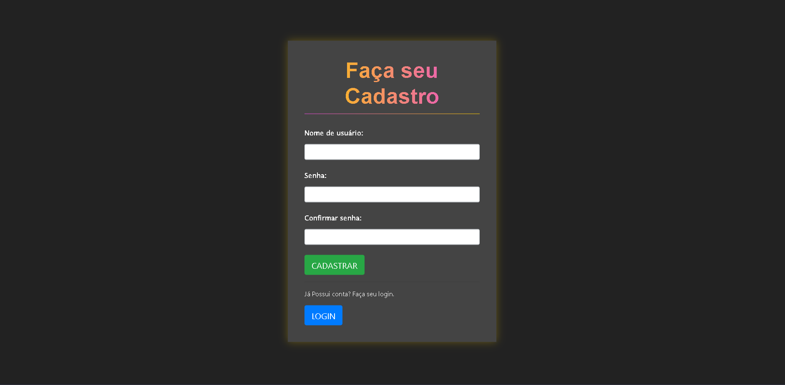
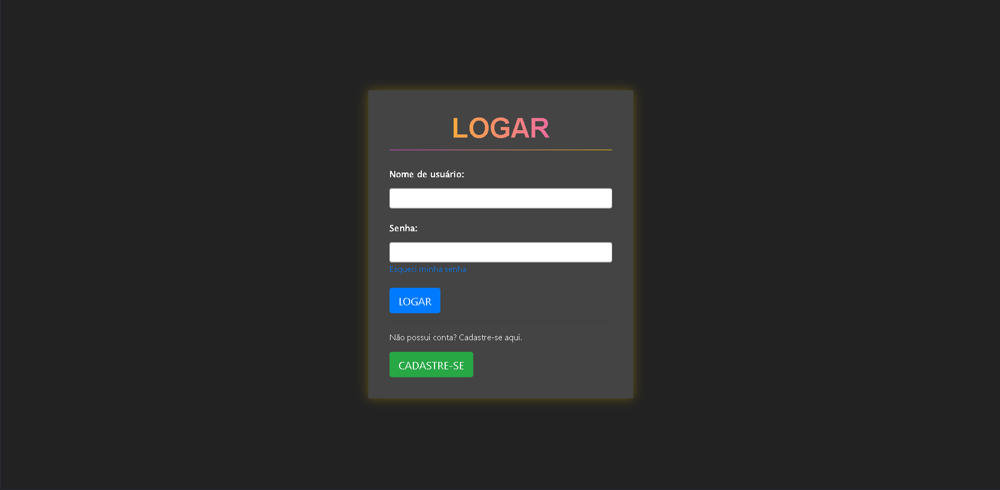
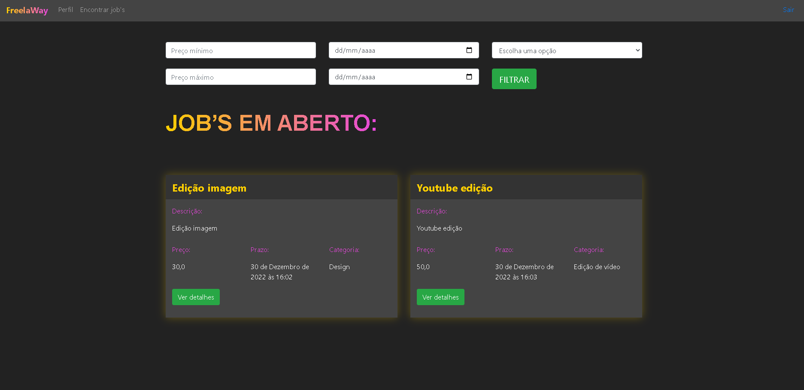
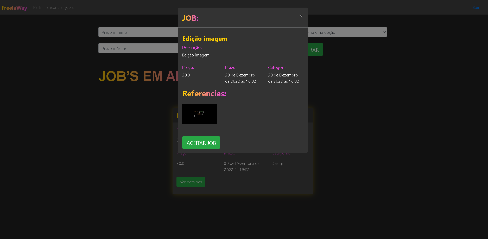
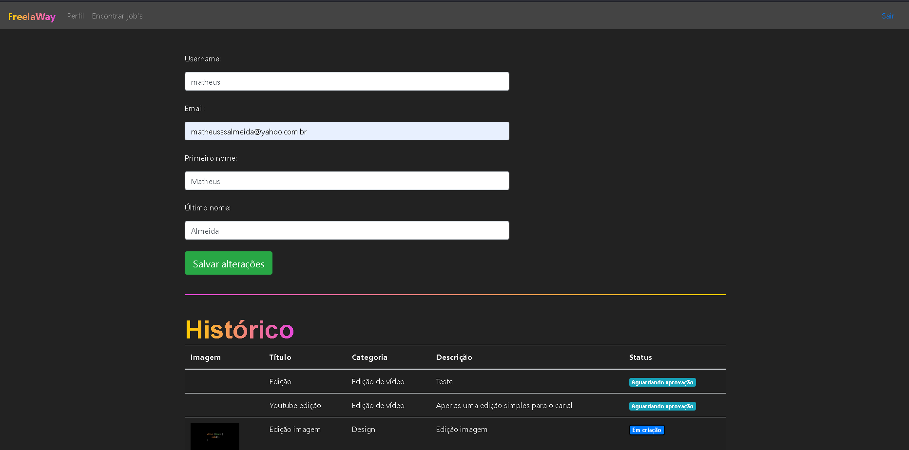

# FrelaWay

O projeto tem como objetivo de cadastrar e logar freelancers, para que possa conseguir vagas em Design ou Edição de Vídeo. Com isso o freelancer pode enviar imagem ou video para o trabalho da empresa escolhida. Tudo isso feito com Django

___

___

## Tecnologias 🖥️

- Python
- Bootstrap
- Django
- SQLite
- Git e Github

___

## Contato ✉️

matheusssalmeida@yahoo.com.br